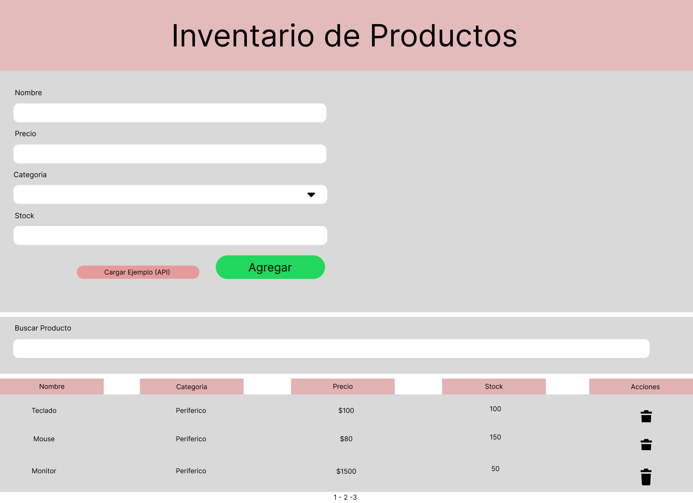

# Parcial 1 – Inventario simple de productos (ACN4BV)

**Alumno:** Matías Paulon  
**Proyecto individual** – JavaScript, HTML, CSS

## Descripción
Inventario de productos con una sola pantalla: permite **agregar**, **listar**, **buscar**, **eliminar** y **persistir** en `localStorage`. Incluye carga de datos de ejemplo desde una **API**.

## Cómo correr
- Opción 1: Abrir `src/index.html` con la extensión **Live Server** de VS Code.
- Opción 2: Doble clic en `src/index.html` 

## Estructura
├─ assets/
│ └─ wireframe.png
├─ docs/
│ └─ informe.md
├─ src/
│ ├─ index.html
│ ├─ style.css
│ └─ main.js
└─ README.md

## Funcionalidades
- Formulario con validaciones (nombre, precio > 0, categoría, **stock > 0**).
- Listado con **búsqueda en vivo** por nombre/categoría.
- **Eliminar** producto (confirmación).
- **Persistencia** en `localStorage`.
- **API** de ejemplo (electronics) para precargar registros (`fetch` + `async/await`).
- Botón **Agregar** deshabilitado hasta que el formulario es válido.

## Requisitos
- [x] Una sola pantalla  
- [x] Informe (`docs/informe.md`)  
- [x] Variables y estructuras de control  
- [x] Arrays y objetos  
- [x] **Clase** con constructor + método (`Producto.precioConIVA()`)  
- [x] **DOM** (interacciones)  
- [x] **Formulario** para agregar  
- [x] **Persistencia** en localStorage (JSON.stringify/parse)  
- [x] Consola sin errores  
- [x] **Commits** visibles en GitHub  
- [x] **Wireframe/Mock** (`assets/wireframe.png`)  
- [x] **API externa** con `fetch` + `async/await`

## Wireframe hecho en figma 

---
